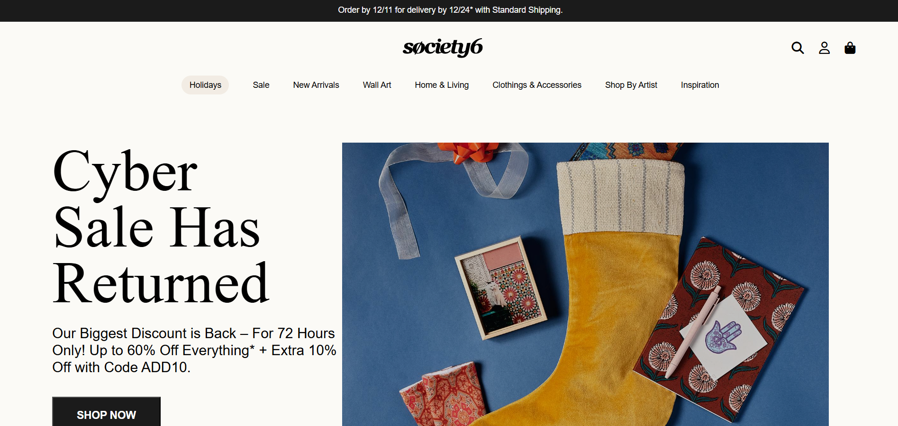

# ✨ Society6 Website Clone

This is a clean and visually appealing clone of the **Society6** website.It was built using **HTML5**,**CSS3** and GSAP(GreenSock Animation Platform) for smooth and attractive animations.This is one of my favorite cloning projects because of its minimal design,smooth user interactions,and clean layout.

---

## 🚀🚀 Live Demo
[Click here to view the live site](https://ibrahimpatel-63.github.io/Society6-Website/)

## 🖼️ Screenshot

## 🛠️ Features

- 🎨 **Clean and Modern UI** Simple, elegant layout inspired by Society6's design.

- ✨ **GSAP Animations** 
- Typing Animation: Text appears as if typed by someone.
- Letter-by-letter Animation: Each letter enters from below and smoothly settles into position.

- 🖼️ **Image Zoom on Hover** Slight zoom effect on images, adding interactivity and dynamism.

- ⚠️ **Not Responsive** this project is **not optimized for mobile or tablet views**.For the best experience, please open it on a **laptop or desktop**.

---

## ⚙️ Technologies Used

- HTML5
- CSS3
- GSAP(GreenSock Animation Platform)

---

## 🧠 What I Learned

- Leveraging GSAP for smooth, complex animations.
- Designing visually engaging layouts with minimalistic approach.
- Enhancing user interaction through hover effects.
- Practicing accuracy by cloning a real-world website design.

---

## 📝 Note

This project is a **front-end clone** created **for educational purposes only**. All content, branding, and design inspiration belong to the original website **Society6**. All rights to the original **Society6** content belong to their respective owners.